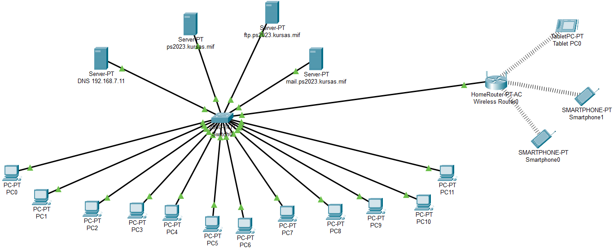

## Sukurkite tinklą, kuriame panaudokite vieną 24 portų komutatorių (pvz. 2960), 12 kompiuterių (PC), bei atskirus serverius/įrenginius: ##
* Komutatoriui suteikite adresą 192.168.7.254/24
* Kompiuterių IP adresai: 192.168.7.201 - 192.168.7.212 (kaukė yra /24, t.y. 255.255.255.0)
* Adresu 192.168.7.11 patalpinkite DNS serverį (atitinkamai pakeiskite kompiuterių DNS nustatymus)
* Adresu 192.168.7.12 patalpinkite HTTP/HTPPS serverį, jo vardas tinkle turi būti ps2023.kursas.mif
* Adresu 192.168.7.13 patalpinkite FTP serverį, jo vardas tinkle turi būti ftp.ps2023.kursas.mif
* Adresu 192.168.7.14 patalpinkite pašto (SMTP ir POP3) serverį, jo vardas tinkle turi būti mail.ps2023.kursas.mif
* Adresu 192.168.7.15 patalpinkite naminį maršrutizatorių („HomeRouter PT-AC“), kuriame leidžiamas DHCP servisas su adresais 192.168.20.100-192.168.20.150. Pabandykite prijungti prie jo 3-4 belaidžius įrenginius (išmaniuosius telefonus, planšetinius kompiuterius) 

