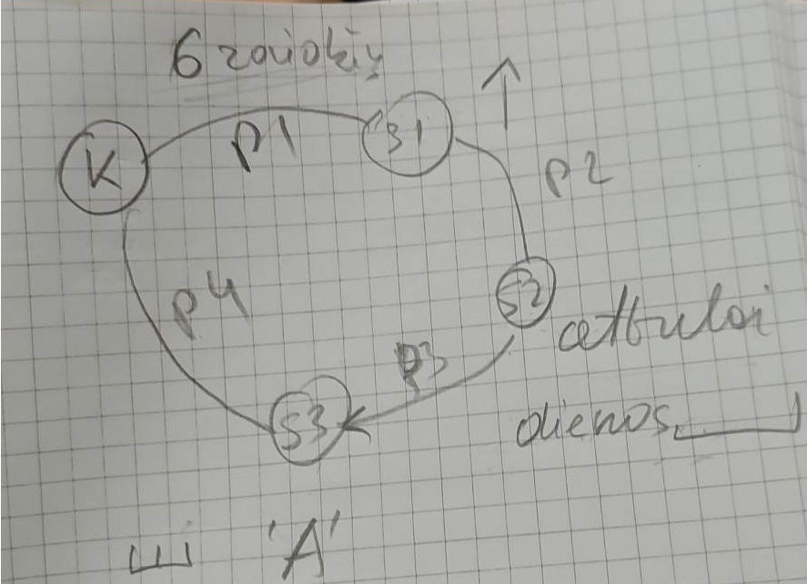

## Rewrite Python client and server examples in C language ##
This laboratory work was done in WSL

## Second task ##
* Client K sends a meesae up to 6 symbols to server S1
* Server S1 receives the messages and makes it all caps, then sends it to S2
* Server S2 receives the messages and reverses,then sends it to S3
* Server S3 adds the number of symbols, next to the received message and sends it to client K

EXAMPLE
* Client K sends "diena"
* Server S1 sends "DIENA" to server S2
* Server S2 sends "ANEID" to server S3
* Server S3 sends "ANEID5" to client K
